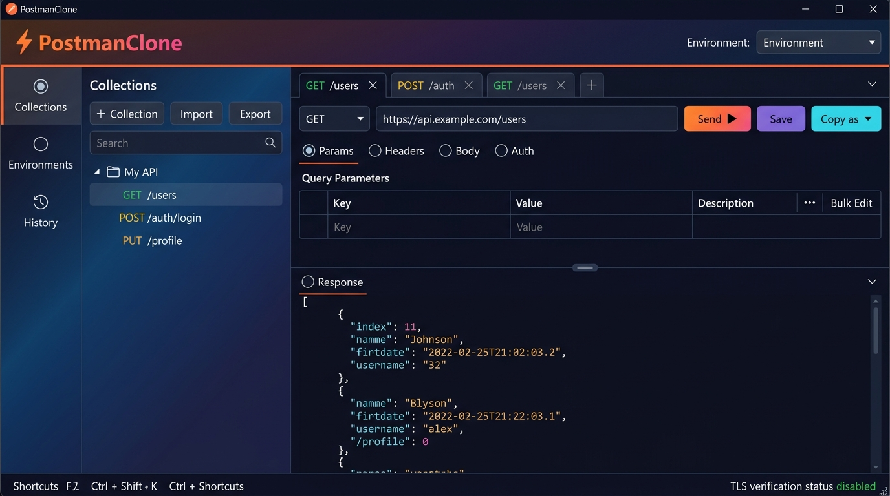

# ⚡ PostmanClone

> **A lightweight, open-source API testing client for Windows — built with WPF and .NET.**

[](https://github.com/Behrad87/postman-clone-app/releases/latest)
[](LICENSE)
[](https://dotnet.microsoft.com/)
[](https://github.com/Behrad87/postman-clone-app/releases/latest)
[](https://github.com/sponsors/Behrad87)
[](https://ko-fi.com/behrad87)
[-00C853?logo=cashapp&logoColor=white)](https://reymit.ir/behrad87)

PostmanClone is a fast, dependency-free desktop API client for Windows developers who want Postman's core workflow — multi-tab requests, collections, environments, and history — without the Electron overhead or a mandatory account.

<p align="center">
  
</p>

---

## ✨ Features

- ⚡ **Multi-Tab Workflow**: Open unlimited parallel requests with per-tab state. Duplicate, close, or middle-click-close tabs. Unsaved-change dot indicator keeps you from losing work.
- 📂 **Collections & Saved Requests**: Organise requests into named collections. Import/export collections as JSON. Reorder requests within a collection via context-menu or arrow buttons.
- 🌍 **Environments & Variables**: Create multiple environments (`Dev`, `Staging`, `Prod`). Use `{{variable}}` interpolation in URLs, headers, and bodies. Variables resolve live; unresolved ones are flagged inline.
- 🔒 **Secret Variables (DPAPI)**: Mark any environment variable as a secret — it is encrypted on disk with Windows DPAPI and masked in the UI behind a toggle-reveal button.
- 📜 **Request History**: Every sent request is logged with method, URL, status code, and elapsed time. Filter and double-click to restore any past request into a new tab.
- 🛡️ **SSL / TLS Control**: Certificates are validated by default (strict). Disable SSL verification globally per-environment or per-request with a single checkbox. Status is always visible in the status bar.
- 🧩 **Body Types**: `JSON`, `Text`, `XML`, `x-www-form-urlencoded`, and `multipart/form-data` (with file-picker support).
- 🔑 **Authentication Helpers**: `No Auth`, `Bearer Token`, and `Basic Auth` presets — no manual header juggling.
- 📋 **Copy as Code**: Export any request as a ready-to-paste snippet — `cURL`, `Python requests`, or `JavaScript fetch`.
- ⌨️ **Keyboard-first**: `Ctrl+Enter` send, `Ctrl+T` new tab, `Ctrl+W` close tab, `Ctrl+S` save request.
- 🔒 **Privacy First**: 100% offline, zero telemetry, zero tracking, no account required.

---

## 🖼️ Screenshots

<p align="center">
  
</p>

---

## 📦 Downloads

Pre-built, **self-contained** Windows packages (no .NET runtime required):

| Platform | Interface | Package |
| :--- | :--- | :--- |
| **Windows (x64)** | WPF GUI | [⬇️ PostmanClone-windows-x64.zip](https://github.com/Behrad87/postman-clone-app/releases/latest) |

> Or clone and build from source — see [Building from Source](#building-from-source) below.

---

## 🚀 Getting Started

1. Download the latest release zip from the [Releases](https://github.com/Behrad87/postman-clone-app/releases/latest) page.
2. Extract and run `PostmanCloneWPFUI.exe` — no installation or sign-in needed.
3. Create an **Environment**, add your base-URL variable, and start firing requests.

---

## 🏗️ Building from Source

**Prerequisites:** .NET 10 SDK (or .NET 8+), Windows

```bash
git clone https://github.com/Behrad87/postman-clone-app.git
cd postman-clone-app
dotnet build PostmanCloneApp.sln -c Release
dotnet run --project PostmanCloneWPFUI
```

### Solution Layout

| Project | Purpose |
| :--- | :--- |
| `PostmanCloneLibrary` | Core logic — HTTP engine, models, import/export, persistence |
| `PostmanCloneWPFUI` | WPF desktop front-end (MVVM) |
| `PostmanCloneUI` | WinForms prototype (legacy) |
| `PostmanCloneCP` | MAUI cross-platform prototype |
| `PostmanCloneLibrary.Tests` | Unit tests |

---

## ❤️ Support the Project

PostmanClone is free and open-source. If it saves you time, consider buying me a coffee — it helps keep the project alive and growing.

| Platform | Link |
| :--- | :--- |
| ☕ **Ko-fi** | [ko-fi.com/behrad87](https://ko-fi.com/behrad87) |
| 💖 **GitHub Sponsors** | [github.com/sponsors/Behrad87](https://github.com/sponsors/Behrad87) |
| 🇮🇷 **Reymit (Iran)** | [reymit.ir/behrad87](https://reymit.ir/behrad87) |

[](https://ko-fi.com/behrad87)

---

## 📄 License

[MIT](LICENSE) © Behrad Zarei